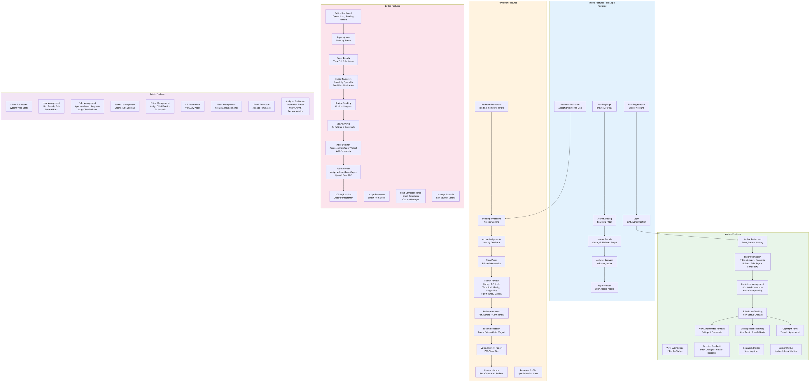
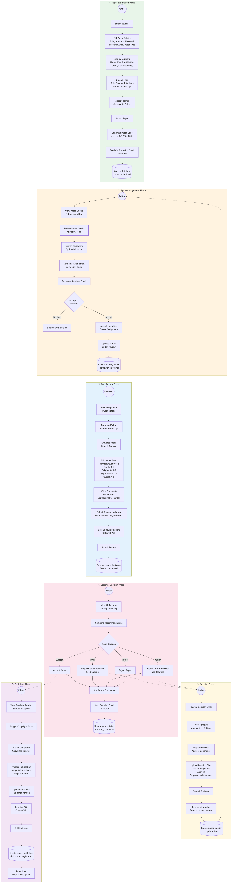
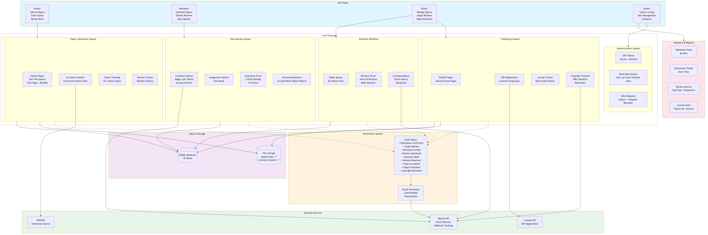

# Breakthrough Publishers - System Diagrams

This document contains all system diagrams including database, architecture, and feature documentation.

---

## Table of Contents

1. [Database Diagrams](#database-diagrams)
   - ER Diagram
   - Class Diagram
   - Relationships Overview
2. [Architecture Diagrams](#architecture-diagrams)
   - Backend Architecture
   - Frontend Architecture
   - Data Flow Architecture
3. [Feature Diagrams](#feature-diagrams)
   - Features Overview
   - Complete Workflow
   - Feature Integration

---

## Database Diagrams

### ER Diagram (Entity-Relationship)


Shows all 18 database tables with their relationships:
- **User Management**: user, user_role, role_request
- **Journal System**: journal, journal_details, editor, volume, issue, news
- **Paper Submission**: paper, paper_co_author, paper_version, paper_comment
- **Review Process**: reviewer_invitation, online_review, review_submission
- **Publishing**: paper_published, copyright_form
- **Email System**: email_template, paper_correspondence

### Class Diagram


SQLAlchemy ORM models with all attributes and relationships.

### Relationships Overview


Grouped view of tables by functional area with key fields.

---

## Architecture Diagrams

### Backend Architecture (FastAPI)


**Layers:**
- **Middleware**: CORS, TrustedHost, Rate Limiter
- **API Routes**: auth, journals, admin, author, editor, reviewer, articles, roles, copyright, webhooks
- **Core**: JWT authentication, password hashing, security utilities
- **Services**: Crossref DOI, Email, Reviewer recommendation
- **Utilities**: Email service (Resend), file handler, token utils
- **Database**: SQLAlchemy ORM with MySQL

### Frontend Architecture (React)


**Structure:**
- **Entry**: main.jsx → App.jsx with React Router
- **Pages**: Public, Author, Editor, Reviewer, Admin dashboards
- **Components**: Forms, Modals, UI elements
- **State**: AuthContext, custom hooks
- **API Layer**: Axios with token injection

### Data Flow Architecture


Complete request/response flow:
1. UI → State → API Client → HTTP
2. Backend: Middleware → Routes → Services → ORM → MySQL
3. External: Email (Resend), DOI (Crossref)
4. Response flows back to update UI

---

## Feature Diagrams

### Features Overview by Role



**Public Features:**
- Landing page, Journal browsing, Archives, Open access papers
- User registration, Login, Reviewer invitation handling

**Author Features:**
- Paper submission (two-file system: Title Page + Blinded Manuscript)
- Co-author management, Submission tracking, View reviews
- Revision resubmission, Correspondence history, Copyright form

**Reviewer Features:**
- Dashboard with stats, Pending invitations, Active assignments
- Review form (5-point ratings), Comments, Recommendations
- Upload review report, Review history

**Editor Features:**
- Paper queue management, Reviewer invitation & assignment
- Review tracking, Decision panel (Accept/Minor/Major/Reject)
- Publishing workflow, DOI registration, Correspondence

**Admin Features:**
- User management, Role management, Journal management
- Editor assignments, News/announcements, Email templates
- Analytics dashboard

### Complete Workflow (End-to-End)



**6 Phases:**
1. **Paper Submission**: Author submits paper with files → Generates paper code → Confirmation email
2. **Review Assignment**: Editor reviews queue → Searches reviewers → Sends invitation → Reviewer accepts
3. **Peer Review**: Reviewer evaluates paper → Fills ratings → Writes comments → Submits review
4. **Editorial Decision**: Editor views reviews → Makes decision → Sends decision email
5. **Revision** (if required): Author prepares revision → Uploads files → Resubmits
6. **Publishing**: Copyright form → Assign volume/issue → Upload final PDF → Register DOI → Publish

### Feature Integration



Shows how all features connect:
- **Core Systems**: Authentication, Submission, Review, Editorial, Publishing
- **External Services**: Resend API (email), Crossref API (DOI), ROR API (institutions)
- **Notification System**: 10+ email types with customizable templates
- **Analytics**: Dashboard stats, trends, review metrics

---

## All Exported Files

| Diagram | PNG | SVG | Description |
|---------|-----|-----|-------------|
| ER Diagram | [er-diagram.png](diagrams/er-diagram.png) | [er-diagram.svg](diagrams/er-diagram.svg) | Database entity relationships |
| Class Diagram | [class-diagram.png](diagrams/class-diagram.png) | [class-diagram.svg](diagrams/class-diagram.svg) | ORM model classes |
| Relationships | [relationships-overview.png](diagrams/relationships-overview.png) | [relationships-overview.svg](diagrams/relationships-overview.svg) | Table groups & connections |
| Backend | [backend-architecture.png](diagrams/backend-architecture.png) | [backend-architecture.svg](diagrams/backend-architecture.svg) | FastAPI architecture |
| Frontend | [frontend-architecture.png](diagrams/frontend-architecture.png) | [frontend-architecture.svg](diagrams/frontend-architecture.svg) | React architecture |
| Data Flow | [data-flow-architecture.png](diagrams/data-flow-architecture.png) | [data-flow-architecture.svg](diagrams/data-flow-architecture.svg) | Request/response flow |
| Features | [features-overview.png](diagrams/features-overview.png) | [features-overview.svg](diagrams/features-overview.svg) | Features by role |
| Workflow | [complete-workflow.png](diagrams/complete-workflow.png) | [complete-workflow.svg](diagrams/complete-workflow.svg) | End-to-end workflow |
| Integration | [feature-integration.png](diagrams/feature-integration.png) | [feature-integration.svg](diagrams/feature-integration.svg) | System integration |

---

## How to Export/Update Diagrams

### Prerequisites
```bash
npm install -g @mermaid-js/mermaid-cli
```

### Export Commands
```bash
cd docs/diagrams

# Export to PNG
mmdc -i diagram-name.mmd -o diagram-name.png -w 2500 -H 2000 -b white

# Export to SVG
mmdc -i diagram-name.mmd -o diagram-name.svg
```

### View in VS Code
Install "Markdown Preview Mermaid Support" extension to preview diagrams in VS Code.

### View in GitHub
GitHub automatically renders Mermaid diagrams in markdown files.
